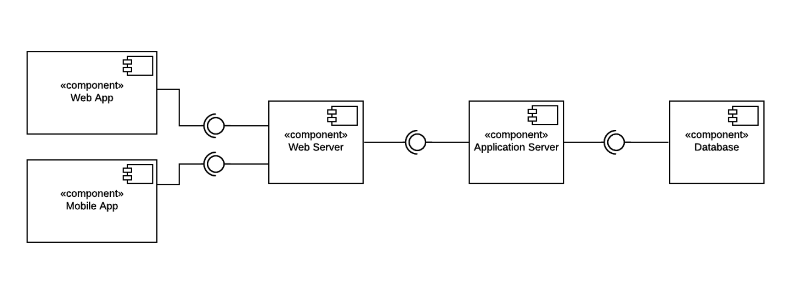
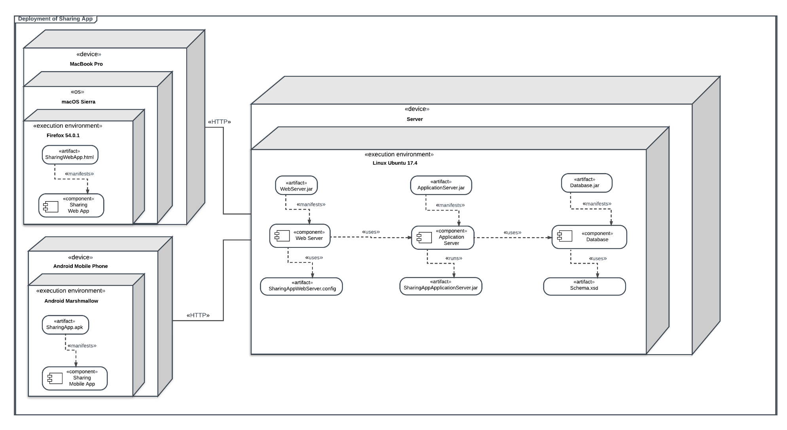
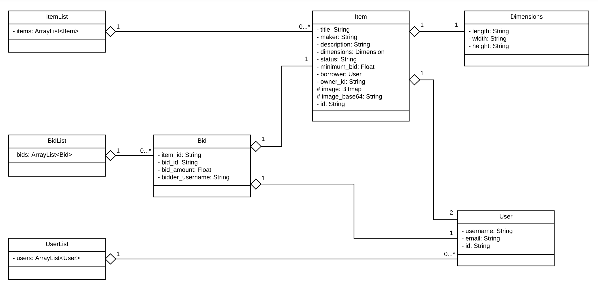
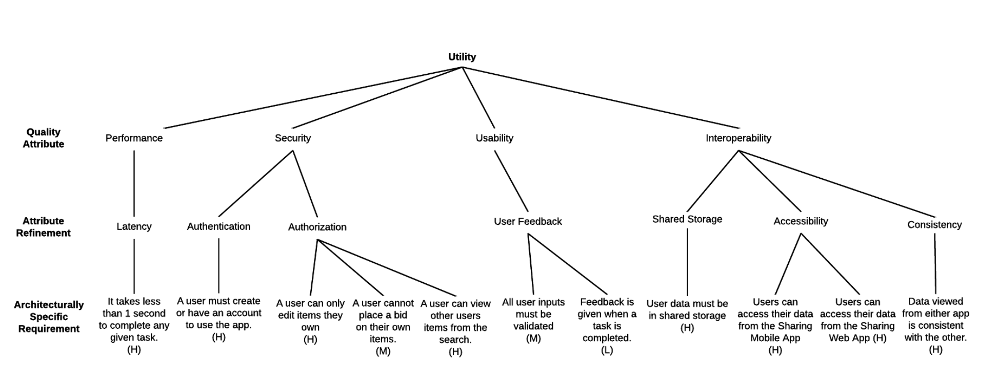

# sharing-app
An Android App with Elastic Search

## Component Diagram

## Deployment Diagram

## Data Storage UML

## Attribute Utility Tree

## User Stories:

- A user of the app is able to create and edit a profile with a unique username and an email address.

- A user of the app is able to login and logout. 

- An owner is able to record the items they own and wish to share.

- A bidder is able to place bids on items they wish to borrow from other owners, which changes the status of the item to “Bidded”.

- An owner is able to accept a bid and lend the item to the bidder, which changes the status of the item to “Borrowed”.

- An owner may change the status of an item they own from “Borrowed” to “Available” when the item is no longer being borrowed.

- An owner may view: all of their items; their “Available” items; their “Bidded” items; or, their “Borrowed” items.

- A borrower may view a list of items they are borrowing.

- A user of the app is able to search a list of all “Available” and “Bidded” items by keywords.

- An owner is able to view the profile of a borrower who is borrowing one of their items.

